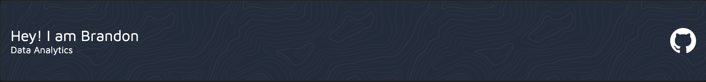

## About Me 👋

<!-- You can create your own header images using Canva, it has a lot of templates. If you do, use the following link https://www.canva.com/join/celeriac-tread-jellyfish -->
Data Analyst with over six years of professional experience working at mid-size to large startups in the CPG, mobile app, and programmatic advertising spaces. I currently work as a Product Data Analyst Team Lead at Fetch, where I generate data-driven product recommendations that help to drive more engaging user experiences.

In my spare time, I try to explore and learn about new technologies in the world of data science and analytics. I am passionate about data and will often share out some personal projects with the world on my blog. Please check it out - [brandonlevan.me](brandonlevan.me)

When I am not working or exploring data analytics, I am digging for new music, re-selling goods on eBay, snowboarding, playing soccer, tennis, or running, trying out new recipes, learning how to become more entrepreneurial, playing Apex Legends with my friends, and just generally trying to grow as a person by reading, exploring the world, and actively seeking new experiences. 

I graduated from Stevens Institute of Technology with a Master of Engineering in Systems Engineering and a Bachelors of Engineering in Engineering Management with a focus on Data Exploration and Visualization for Risk and Decision-Making.

I am a very highly creative, hard-working, and driven individual, with an eye for detail, seeking to explore new career opportunities in data analytics. Please feel free to reach out to me at brandon.levan1014@gmail.com if you have any opportunities that you think may be of interest to me given my work experience or background. Thank you

## Navigating My GitHub 
My GitHub is composed of two different folders - One that contains my personal data science projects and one that hosts the projects I completed to graduate from the TripleTen Data Science Bootcamp
- Personal Data Science Projects
  - fasfa
- TripleTen Data Science Projects
  - fasfa

## My Skills 💻
- Node.js
- TypeScript
- 
- NestJS
- Ethereum
